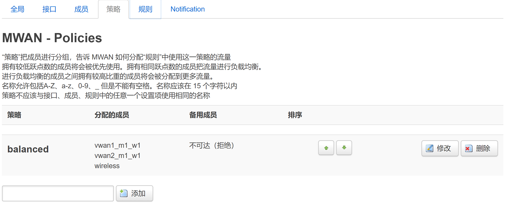

+++
title = "Openwrt折腾记录"
date = "2020-10-02"
description = "折腾了一下以前捡来的newifi mini，这路由器openwrt固件的5G经常出毛病，给我坑了一天多，枯了"
categories = [
    "折腾"
]

tags = [
    "计网"
]

+++

# 需求

因为宿舍的网络限制，某些账号可以有线登录但是12点后断网，另一部分账号不断网但是只能连接无线AP，因此尝试通过openwrt的多播+mentohust实现同时登录两种账号，实现24h高速上网（

# 固件

先刷[breed](https://breed.hackpascal.net/)，newifimini芯片为mt7620&型号为y1，下载对应固件[breed-mt7620-lenovo-y1.bin](https://breed.hackpascal.net/breed-mt7620-lenovo-y1.bin)

PC关掉DHCP，刷固件时网关为192.168.1.1，静态IP搞一搞


按住reset键擦腚，揩鸡，5s之后松手就可以开刷了

刷入之后固件更新->固件->选择文件，上传openwrt固件

从恩山找了个[openwrt固件](https://www.right.com.cn/forum/thread-4050949-1-1.html)，太花里胡哨的容易卡，前端资源太大了，朴实无华的就行。这个自带插件比较好用

> https://pan.baidu.com/s/1AOYK3O1sO4bdoC1P7dLycA 提取码: 9xjf

# 配置

### 有线连接

#### 虚拟网卡


首先`网络->多线多播`，通过macvlan创建虚拟网卡，之后通过mentohust分别在每个虚拟网卡上登录账号

进入`网络->接口`，查看网卡是否创建成功


因为锐捷是DHCP，若默认为ppoe拨号，需要点击右侧`修改`，在基本设置中将传输协议改为`DHCP客户端`，当获取到IPv4地址即成功

#### mentohust

多播参考[锐捷多播](https://github.com/tkkcc/mentohust)，mentohust启动后删除pid文件即可再次启动

```bash
rm /var/run/mentohust.pid -f
```

每次启动使用-n指定不同网卡即可同时登录多个账号

### 无线连接

`网络->无线->扫描`，选择需要连接的wifi连入，“新网络的名称”用于指定该网络接口的名称

完成后应当为Client模式，路由器自动为其分配wlanX网卡


### 均衡负载

1. `网络->均衡负载->接口`，通过多线多播创建虚拟网卡后会自动配置vwan接口的均衡负载，此时需要手动添加无线wlan接口：

   

   

   

   输入接口名称（连入wifi时在“新网络的名称”设置），点击添加

   设置好相关接口网络状态检测参数后，保存&应用

2. `网络->均衡负载->成员`，添加刚刚的无线接口，作为参与均衡负载的负载接口

   

   

   

   输入成员名称（随便写），点击添加

   

   

   

   跃点数和比重可以简单理解为优先级，跃点数为第一优先级，比重决定负载比例，默认即可

3. `网络->均衡负载->策略`，将成员添加进均衡负载策略

   

   

   

   点击修改

   

   

   

   绿色加号添加刚刚创建的成员`wireless`

4. 保存&应用

5. `状态->均衡负载`，查看当前接口状态（暂时只登录了一个有线账号，所以vwan2检测到离线）

   

   

   

   配置成功

### DDNS

`服务->动态DNS`，先去dns服务商申请token，用于解析的域名不要使用顶级域名，这里的脚本会出bug


查询主机名是用于查询验证解析结果的域名，与[域名]保持一致即可

### DHCP/DNS

`网络`中的`主机名`和`IP/MAC绑定`不起作用，请直接使用`网络->DHCP/DNS`，使用`自定义挟持域名`时记得确认相关接口的DNS服务器，否则路由器劫持无法生效

### 计划任务

`系统->计划任务`，设置crontab计划任务

```bash
*/10 * * * * mentohust
20 7 * * 1-5 etherwake -D -i "br-lan" "xx:xx:xx:xx:xx:xx"
```

每隔十分钟自动重连mentohust，周一到周五早上7:20网络唤醒工控板