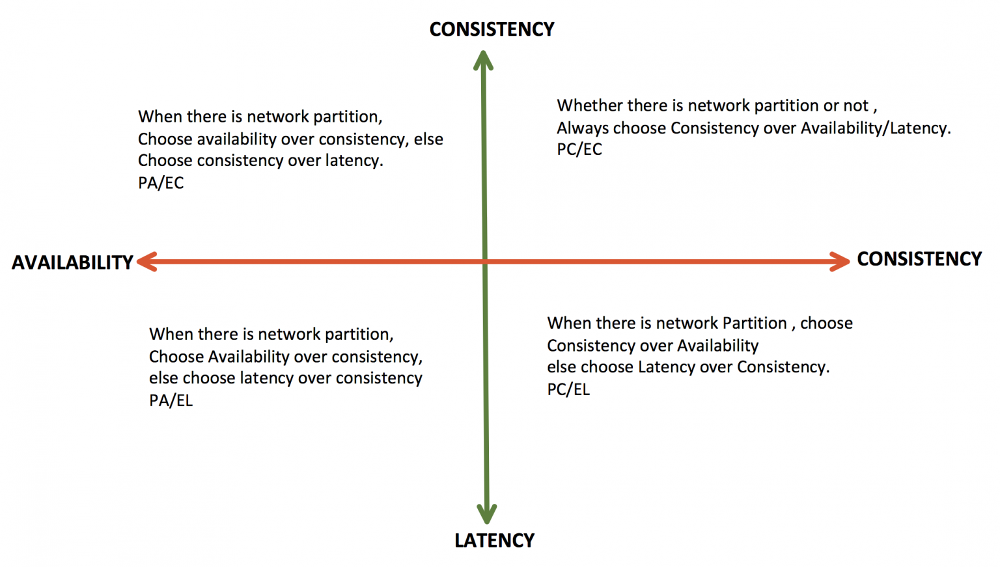
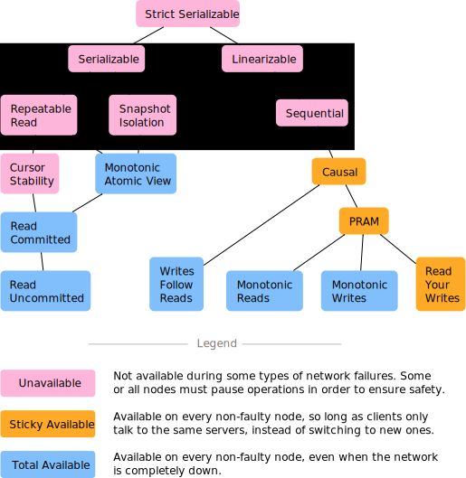
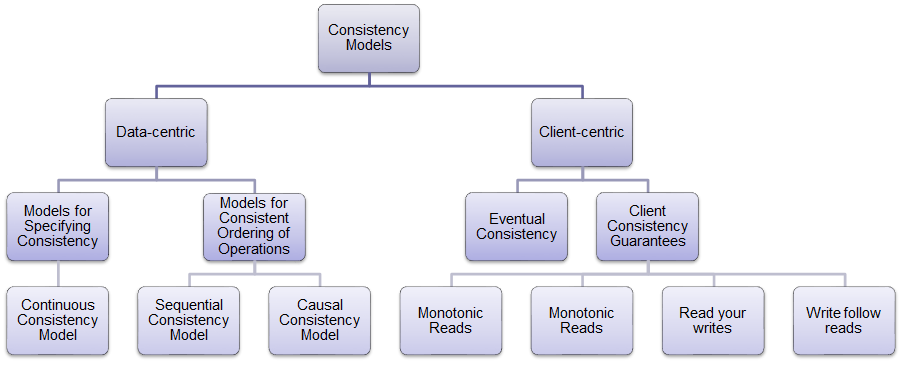
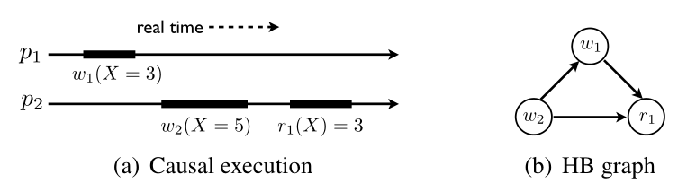
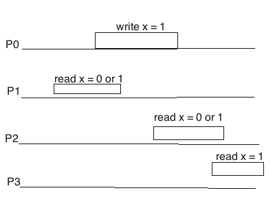

# 基本概念

## 数据库一致性与分布式一致性

`ACID`和`CAP`分别是数据库领域和分布式系统中的最基本概念，虽然其中的C都解释为一致性Consistency，但对应的实质意义完全不同。

`ACID`是指数据库系统中，为保证数据库事务正确性所必须具备的四个性质：[原子性](https://zh.wikipedia.org/w/index.php?title=原子性&action=edit&redlink=1)（atomicity）、[一致性](https://zh.wikipedia.org/wiki/一致性_(数据库))（consistency）、[隔离性](https://zh.wikipedia.org/wiki/隔離性)（isolation）、[持久性](https://zh.wikipedia.org/w/index.php?title=持久性&action=edit&redlink=1)（durability）。这个概念描述的是数据库系统在事务中的数据和状态转移满足容错约束，故而其中一致性要求的是：在执行事务的过程中，数据必须始终满足预设条件。其实更多情况下这是一种业务逻辑的保证，比如，借贷业务中借款和贷款的总额必须始终相等。~~有说法是C最早就是拿来给ACID凑个单词的~~

`CAP`如刚刚所说讨论的是单一读写对象的分布式系统，这里的一致性要求集群内通过数据复制等方法解决节点间的数据差异，但并不涉及多对象的事务。

另外，传统单机数据库大体上并不需要处理分布式系统中的种种网络故障；当然考虑到现代多核CPU的缓存模型，数据库的多核并发事务控制需要基于`TSO(Total Store Order)`模型或`Relaxed Memory Consistency`做额外的设计，使用`memory fence`保证数据在核心之间的一致性。同样的，在更大的集群尺度上，分布式数据库的事务隔离也需要依赖类似的一致性模型和同步原语~~，套娃了属于是~~。

## FLP Impossibility

FLP是分布式系统中重要的原理之一，它展示了如果我们想要在异步网络中处理共识所必须作出的取舍。介绍FLP之前，首先我们需要理解何为共识(Consensus)——分布式系统中最重要的问题之一。

共识要解决的主要问题是容错处理(fault tolerannce)。比如采用状态机复制(State Machine Replication)处理数据复制问题的时候，我们要在某一个步骤中让一个系统中所有的节点对一个值达成一致，也就是共识；但如果系统中存在故障，我们要忽略掉这些故障节点的干扰让整个系统继续正确运行，这就是容错处理。共识问题的难点就在于如何在异步网络中如何处理容错（没有全局时钟，消息延迟没有上限）。

共识问题的定义包含了三个方面，一般的共识问题定义为：

1. termination: 所有进程最终会在有限步数中结束并选取一个值，算法不会无尽执行下去。
2. agreement: 所有非故障进程必须同意同一个值。
3. validity: 最终达成一致的值必须是$V_1$到$V_n$其中一个，如果所有初始值都是$V_x$，那么最终结果也必须是$V_x$。

这三个要素定义了所有共识问题的本质，其中termination是liveness的保证，agreement和validity是safety的保证。分布式系统的算法中liveness和safety就像一对死对头，FLP证明了在异步网络有一个故障节点的时候termination是无法满足的，这时候最多只能满足safety的两个条件，所以[线性一致](#linearizable（线性一致性）)的算法是无法保证liveness的，如果你要safety那么就会可能进入无限循环。

有了FLP的指导，我们能够理解设计算法的时候要有取舍，比如Paxos/Raft等数据复制算法必须要放松liveness才能实现[线性一致性](#linearizable（线性一致性）)，我们可以理解理论上极端情况下Paxos/Raft可能永远无法结束，只能在工程上引入随机性降低这种极端情况的可能性。

## 线性化与串行化

线性化与串行化同样也是分布式和数据库两个易于混淆的概念。实际上，对于读写操作而言，线性化等价于atomic consistency（原子一致性），也就是`CAP`定理中的一致性C；而串行化属于`ACID`中隔离性I范畴，是有关于事务的保证。简要而言，二者的核心区别如下：

> - Linearizability: single-operation, single-object, real-time order
>
>   线性化：单个操作，单个对象，实时顺序
>
> - Serializability: multi-operation, multi-object, arbitrary total order
>
>   串行化：多个操作，多个对象，任意总顺序

前两者可能比较易于理解，多对象、多操作直接意味着跨越数据分区（节点）的数据协调，而线性化主要关注于“数据复制”模型下单个操作在各个节点的发生顺序。“顺序”是分布式系统设计中的核心概念之一，原因在于“顺序”往往意味着因果关系，如果底层的分布式系统不遵守因果关系，会产生诸多反直觉的数据状态，为上层应用的开发带来诸多困难。

具体到两个概念的顺序约束，线性化要求的是“实时顺序”，系统必须遵守一个全局的“绝对时钟”，全部节点的操作逐一发生，确保状态实时一致和同步，这在效率上往往小于单机执行，因为全局同步的要求阻止了系统并发，还要付出额外的通信和等待开销。实际上，线性化的本质就是对共识问题中safety的保证，因此不得不放松liveness的要求，关于这二者的关系以及共识问题会在后文中详细讨论。这也就是为什么现代多核CPU及其缓存系统采取更宽松的TSO模型，只在必要时通过同步原语达成一致性。

相反，串行化并不如字面意义上必须真正“串行”，只要能避免各个事务之间的数据竞争，或者说看起来像串行即可。“任意总顺序”并不意味着任何一种确定的顺序，它并不强加任何实时约束在事务的顺序上，即使同一个进程内部的事务也可以发生重排。所以说真正要求“串行”的其实是Linearizability，反而Serializability关注的核心在于“隔离”。

## CAP与PACELC

> It states that in case of network partitioning (P) in a distributed computer system, one has to choose between availability (A) and consistency (C) (as per the CAP theorem), but else (E), even when the system is running normally in the absence of partitions, one has to choose between latency (L) and consistency (C).

PACELC表明：当分布式系统发生网络分区(Partitioning)时，必须在可用性(Availability)和一致性(Consistency)之间做出选择，即使(Else)没有发生分区故障，也必须在延迟(Latency)和一致性(Consistency)之间做出选择。

基于此，分布式系统大体上可以做出四类选择：



|                     | P(发生网络分区) | E(无网络分区) |
| ------------------- | --------------- | ------------- |
| A(可用性)\L(低延迟) | PA              | EL            |
| C(一致性)           | PC              | EC            |

在直观上也很容易理解这种取舍：更强的一致性就要求集群中的节点间交换更充分的信息，必然需要在副本节点之间做更多通信和协调工作，或者在网络故障时由于无法满足必要的信息交换从而停止服务，这降低了系统的可用性和性能。

实际上，PACELC并不能称为一个“定理”，论文中并没有进行形式化的证明，而是详细讨论了“数据复制”这一问题在实现上的取舍。数据复制也是分布式系统中最基本的问题，毕竟共识问题大体上也就是考虑容错地复制数据，关于分布式一致性的讨论也通常是在一个提供KV读写，节点间复制的系统上进行。PACELC这种划分并不算准确，因为这些性质的权衡点往往是一个连续可选的spectrum，实际生产中的系统也很难通过所谓`AP`或者`CP`准确定义，后文会详细介绍各种常见的一致性。

而CAP定理则是一个基于以下的理想模型严格证明的定理：

> 1. Consistency（atomic consistency）是指Linearizability（线性一致性）。
> 2. Availability是指non-failing node必须返回结果（可能返回的结果不一定正确，但是一定会返回结果而不是无限循环或者失败）, 并且不对相应时间有上限要求。
> 3. Partition tolerance是指网络断开为两个以上的分区的时候, 节点之间会丢失消息。除非你设计了一个单节点的系统，否则在分布式系统中这其实不是一个Option, 这是一个不可避免的事实。 此外，系统处于异步网络中，没有全局统一的物理时钟，消息延迟没有上限。

Lynch证明了，基于这种定义的CAP，我们最多只能同时满足其中两个性质，但论文中也指出，这仅仅是展示分布式系统中safety和liveness无法被同时满足的一个特例。实际上我们可以把Consistency扩展为safety，某些情况下仅确保agreement放弃validity，容忍错误的共识换取更高性能；Availability也可以扩展为liveness，更进一步要求节点状态making progress，而不仅仅是返回一个结果。

当然，实际工程中也没有必要强求全部节点都能返回结果，即使发生了网络分区，Paxos/Raft仍然可以在超过半数节点的分区中making progress，因此工程上可以采用均衡负载和健康检查等机制，从集群外部获得线性一致性。另一方面，[线性一致性](#linearizable（线性一致性）)为确保safety牺牲了liveness，在数据安全性要求不高且业务有较高性能要求的场景下，可以降低一致性的限制，换取更高的性能。

## CAC

显然，网络分区Partitioning作为一个分布式系统中的客观事实，在工程上没有太多讨论的意义。相反，在放弃了[顺序一致性](#sequential（顺序一致性）)之后，我们不得不面对并发冲突，这时候收敛性Convergence就变得尤为重要。收敛性指的是确保一个节点发出的写被其他节点观察到的能力，这种能力描述了系统safety和liveness之间的权衡，在实现上主要体现为冲突处理和通信策略的选择。而CAP没有讨论收敛性的原因在于，[顺序一致性](#sequential（顺序一致性）)和[线性一致性](#linearizable（线性一致性）)的前提是全局观察到的操作序列统一，默认提供了收敛性的保证。

首先，为了讨论分布式一致性强弱，需要对其作出形式化的定义：记模型$C_s$下所有合法的操作序列$E_{C_s}$，以及模型$C_w$下合法的操作序列$E_{C_w}$，如果有$E_{C_s} \subset {E_{C_w}}$，说明$C_s$在$C_w$的基础上具备更严格的约束，也就称$C_s$强于$C_w$。直观地来讲，我们可以将系统视作一个黑箱，输入一些操作序列并判定是否符合系统约束，显然，可接受的操作序列越少，系统约束越强，一致性也就越强。

虽然这种定义乍一看非常符合直觉，但如果不加入收敛性的要求，我们会发现存在很多高一致高可用，但丢失了共识的极端模型。比如一个放弃任何节点间通信的系统，令每个节点各自独立处理请求，尽管完全不“分布式”，却满足可用性——显然每个非故障节点都可以正常工作；甚至还具有强于[因果一致性](#Causal（因果一致性）)的语义——毕竟每个节点内部都是顺序执行，没有节点间同步当然也不会违背因果关系。

论文Consistency, Availability, and Convergence证明了：**在一个总体可用、单向收敛的系统中，不可能提供比实时因果一致性(RTC)更强的一致性**。所谓单向收敛，就是说节点之间的同步无需交互协议，只要节点$s$将更新发送到节点$d$，节点$d$再将更新发送到节点$s$，两个节点的状态即可达成一致，不需要往返协商。这是非常重要但容易被忽视的前提，因为实际中的系统大多采用双向收敛，节点间可以交换更多信息以协同解决冲突，取得更强的一致性；而单向收敛通过放弃一定的收敛性，换取延迟敏感网络中的性能，减少同步时所需的数据发送。

除了通信策略，冲突处理也是影响收敛性的一个因素。面对数据冲突时，很多系统仅基于时间戳或者节点优先级执行覆盖写入，被覆盖的数据在实际上将无法被节点观察，故而也会削弱收敛性。显然，减小这种影响的最简单办法就是放弃数据层的冲突处理，将所有冲突写入打包成`writeList`全部返回到应用层，将冲突处理交由应用层解决。

最后，关于RTC的具体内容，将会在[因果一致性](#Causal（因果一致性）)中详细讨论。

# 一致性模型

下面这张图出自[Jepsen](https://jepsen.io/)官网，总结了隔离性与一致性的各个等级与其各自的可用性。结合图注可以看出，随着一致性和隔离性约束的增强，系统的可用性逐渐降低，这也一定程度上对应了`CAP`定理的描述。



> - 不可用：发生某些类型的网络错误时不可用。为了确保安全性，部分或全部节点必须停止运行。
> - 粘性可用：只要某个节点正常运行且客户端始终与其通信，就总可以取得进展。
> - 总体可用：即使网络崩溃，只要节点正常运行就可用。

以数据复制为基础构建的分布式系统中，一致性模型通常可按照`Data-centric（数据为中心）`和`Client-centric（客户端为中心）`来划分。`Data-centric consistency ` 要求以整个系统作为观察视角，全局的进程（客户端）需要同时满足一定的约束，而客户端为中心的一致性只要求单个进程视角下的一致性。由于`Data-centric consistency `需要在某种`Client-centric consistency `基础上，额外维护一个系统层面的全局视图，因此当各个进程操作的数据互相独立时，这种全局视图往往造成不必要的开销。

必须要再次强调的是，这里一致性所讨论的模型，是一种**单对象**，**单操作**，**读写操作**的KV系统。当然，根据CAC理论的讨论，我们可以把冲突处理上移至应用层，这就需要在冲突时返回相关的并发操作。



## Read Your Writes（写后读一致性）

Read Your Writes也称为Read-after-write Consistency，顾名思义即指对于单个进程$P$，只要执行某个写入操作$W_1(x)$，随后的读取$R(x)$一定能够取得$W_1(x)$的写入值。

`RYW`不要要求进程间的读写顺序保障，只要确保单机节点顺序执行，就能以粘性可用（Sticky Available）提供这种保证。当然，为了分布式系统的可靠性和效率，我们通常会对数据进行复制。比如，选择主-从复制这类具有领导者的复制模型时，可以采取读写分离的方式降低主库压力，但由于拷贝延迟，从库必然落后于主库，简单的直接访问从库无法提供这种一致性，这时就需要一些基于版本号的路由机制确保客户端能够读取最新数据。

## Monotonic Writes（单调写一致性）

单调写确保单个进程$P$顺序执行写入操作$W_1(x)$, $W_2(x)$时，所有进程观察到的操作顺序总是$W_1(x)$优先于$W_2(x)$，防止写入指令的乱序。

无论单调读或单调写，由于单机读写的默认有序性，我们总可以通过粘性可用的方式达成单调保证。当然，不同于刚刚所说的`RYW`对数据not stale的要求，单调保证只要求所有进程观察到的操作有序，我们通过可以为操作标记连续递增索引等方式（例如raft中的nextIndex机制）来达成这种单调和连续性。

## Monotonic Reads（单调读一致性）

单调读确保单个进程$P$顺序执行读取操作$R_1(x)$, $R_2(x)$时，$R_2(x)$观察到的状态不能早于$R_1(x)$，也就是防止读取的数据出现“时光回溯”。同样，单调读只需保证单个进程内部的操作有序，除了粘性可用之外，只要客户端缓存先前读取结果及时间戳，也可以实现总体可用的单调读取。

## Writes Follow Reads（读后写一致性）

读后写一致性，也称为会话因果性，指进程$P$对数据项$x$执行读操作$R_1(x)$之后，对$x$任意的写操作$W(x)$发生在不低于$R_1(x)$的版本上。也就是说，读取操作被赋予了一定的fence语义，任何进程如果读取到进程$P$的$W(x)$，就一定能读取到$R_1(x)$所见的历史操作。需要采取`WFR`的一个实际场景举例如下：

> 如果用户A在帖子中读到了用户B的评论$C_1$​​，并回复了评论$C_2$​​​。这时如果没有遵守写后读一致性，可能导致评论$C_2$​​​​写入到了一个陈旧的副本中，当其他用户读取这个陈旧副本时会发现一个凭空出现的评论$C_2$​​，破坏了回复的因果性。

大体上而言，以上四种一致性分别约束了客户端模型下的$W-R$​​, $R-R$​​, $W-W$​​, $R-W$​​操作有序，为更高层面的一致性提供了保障。​

## PRAM

PRAM（Pipeline Random Access Memory）等价于前述`RYW`、`MW`、`MR`的组合。严谨地来说，这种模型不保证观察到的全体写入操作序列$S$​​​有序，但确保来自某个进程$P_i$​​的子写入序列$S_i$​​​总体有序。下面这个例子符合PRAM，但$P_4$不符合更进一步的因果一致性：

```
P1:W(x)1R(x)1
P2:           R(x)1W(x)2W(x)3
P3:                           R(x)1R(x)2R(x)3
P4:                           R(x)2R(x)1R(x)3
Time ---->
```

$P_3$和$P_4$的读取子序列均为${ R(x)1\\}$,$\{R(x)2,R(x)3\}$，分别符合$P_1$及$P_2$的写入顺序。但由于$P_2$的写入操作前执行了$R(x)1$，导致$P_1$和$P_2$间产生了潜在的因果联系（比如购买商品时，首先读取库存数量，再对库存数量-1）。$P_4$观察到的整体顺序虽然分别符合$P_1$和$P_2$的操作序列，但是进程间操作的乱序可能造成因果倒置。显然，在这里添加`WFR`保证后${R(x)1}$将被强制排在$\{R(x)2,R(x)3\}$之前，即可唯一约束到$P_3$所见的顺序，这便得到了因果一致性模型。

## Causal（因果一致性）

因果一致性是最为混乱的一致性概念，因为`收敛性`在其中具有非常重要的影响，其内部也存在强弱划分。所以首先我们要明确因果性的定义：

1. 同一进程：$P_a$和$P_b$是一个进程执行的两个操作，如果$P_a$发生在$P_b$之前，那么$P_a \rightarrow P_b$
2. 不同进程：如果$P_a$是一个写操作，$P_b$是一个读操作且返回了$P_a$的写入值，那么$P_a \rightarrow P_b$
3. 传递性：对于操作$P_a$, $P_b$和$P_c$，如果$P_a \rightarrow P_b$且$P_b \rightarrow P_c$, 那么有$P_a \rightarrow P_c$

这种约束形成了一种偏序关系，将操作按照因果性连接会构成一个DAG，也就是说在这种模型下存在无法比较顺序的事件，即并发操作。处理并发冲突时，一种普遍的方法是`last-writer-win`，也就是直接覆盖写入。这种简单粗暴的做法除了会导致数据丢失，还会造成系统可接受的序列集合扩张，降低系统的一致性——覆盖其他的写入导致这些操作产生的约束也被忽略了。比如论文中给出的例子：



这里使用了节点标号作为更新优先级，低标号的$p_1$具有高优先级，因此$w_1$覆盖了来自$p_2$的$w_2$。在操作时序图上，虽然$w_1$的发生时间较早，但因为覆盖了$w_2$的写入，因此逻辑上变为了$w_2$的后继操作，这被称为违反了实时性($u.endTime < v.startTime ⇒ v \not\prec_G u$)。

此外，因果性定义中的第二点也并没有约束进程间数据同步的时延，所以如果将进程间通信延迟拉长到无穷，模型就会退化到前面所提到的所有节点互相隔离的情形。所以，我们需要引入收敛性，在因果一致性的前提下进一步调整系统的safety和liveness。

如前文提到的，RTC就是在单边收敛下最强的因果一致性，它在基本的因果性之外添加了实时性要求。RTC的实现是通过向量时钟追踪因果性，遇到并发冲突时向上层提供所有的最新写入，交由应用层处理合并。因为系统本身不对并发操作进行冲突合并，向量时钟的单调性也确保了顺序操作在时序图上有序，这便满足了实时性要求。这种做法看似优雅，但问题在于向量时钟需要维护全局视图，向量长度随着客户端数量的增加线性增长，在大多数操作并不相关的情形下仍要$O(n)$全量同步，无主复制的广播更进一步放大了开销。这也是为什么MongoDB等nosql数据库往往采用LWW此类简单的冲突解决规则，只提供`Client-centric`的因果一致性，而不是RTC这种更强的`Data-centric consistency`。

## Sequential（顺序一致性）

顺序一致性更进一步的约束在于要求了全局一致性，每个进程上观察到的全局操作序列$S$都是一致的，并且符合实际客户端的编程顺序，这种全局性也就实现了前文CAC提到的收敛性。实际上，顺序一致性只要求所有进程看到的事件历史一致有序，满足前述的几种基本操作的顺序性，但不需要符合物理时间上的先后顺序，所以下面这种情况也是合法的：

```
P1:W(x)1
P2:      W(x)2
P3:            R(x)2R(x)1
P4:                R(x)2R(x)1
Time ---->
```

虽然物理时间上$x$先被$P_1$写入了1，后被$P_2$写入2，但只要$P_3$,$P_4$一致认为情况相反，那就并不违反顺序一致性的要求，毕竟这并不违反$P_1$,$P_2$各自的编程顺序，全局观察到的历史操作序列也一致。

## Linearizable（线性一致性）

线性一致性是针对单一操作的最高的一致性模型，基于顺序一致性的基础上增加了物理时间的约束，所有进程观察到的全局操作序列$S$必须反应真实的顺序。当然实际系统中的任何操作都具有时间开销，因而总是存在真正物理时间上重叠的并发操作，即使线性化也无法约定这种真实并发事件之间的顺序，比如：



这里，$P_0$与$P_2$的操作存在时间上的重叠，两者可以任意排序，若$P_2$中read操作排序在前则可以读出0值。换而言之，线性一致性要求的是更进一步的实时性，即$u.endTime < v.startTime ⇒ u \prec_G v$。

# 参考资料

1. https://en.wikipedia.org/wiki/Consistency_model
2. [MongoDB 一致性模型设计与实现](https://mongoing.com/archives/77853)
3. http://jepsen.io/consistency
4. [《Designing Data-Intensive Application》](http://shop.oreilly.com/product/0636920032175.do)
5. [分布式系统一致性的发展历史 (二)](https://danielw.cn/history-of-distributed-systems-2)
6. [分布式系统一致性的发展历史 (六)](https://danielw.cn/history-of-distributed-systems-6)

