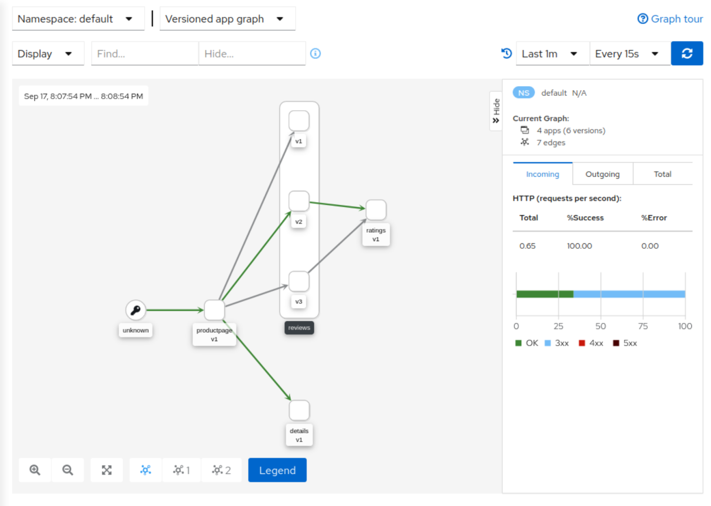
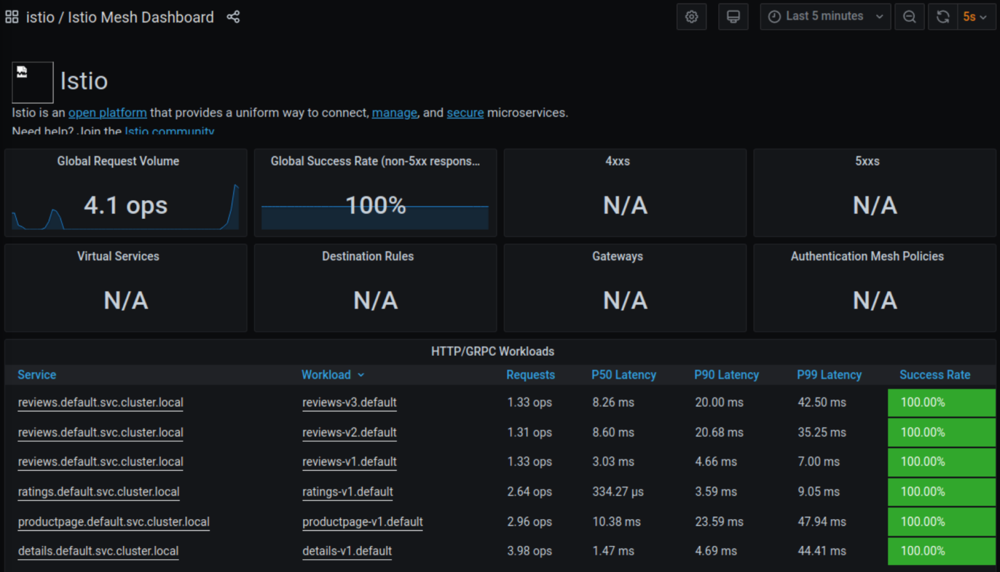
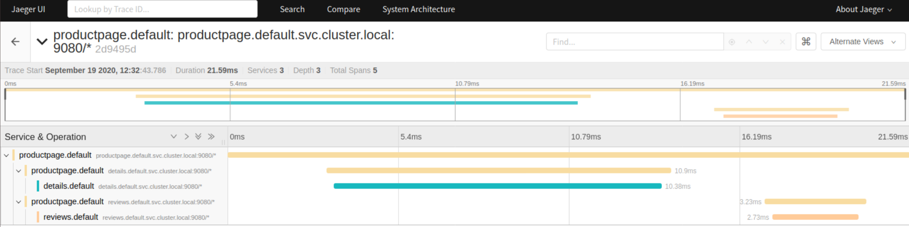
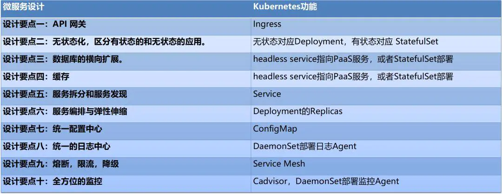
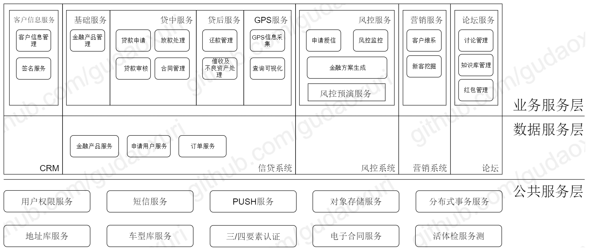
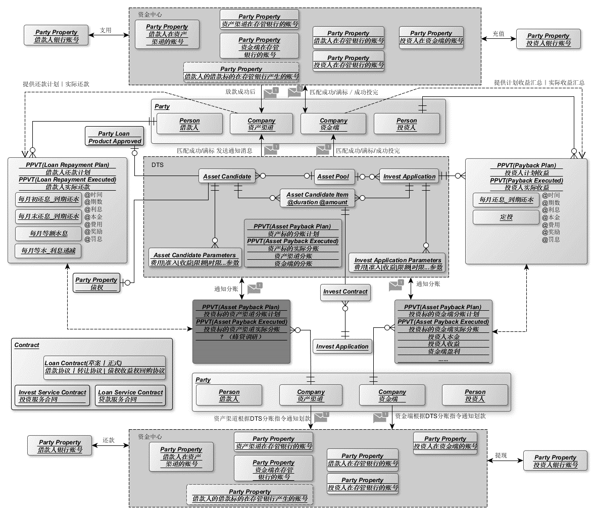

# 环境安装

配置于ubuntu18.04+vmware虚拟机环境下 已提前安装docker

K8s: 1.19.0 Istio: 1.7

## Kubernetes安装

### 配置部分

copy虚拟机快照后，修改主机名，ip地址和mac地址，防止冲突

（可先跳至安装部分，除网络部分全部配置完毕后，再进行快照copy，避免多次重复安装）

1. 配置网络

   ```shell
   # 配置ip, hosts, dns
   sudo vim /etc/network/interfaces 
      
   auto ens33
   iface ens33 inet static
   address 192.168.98.3
   netmask 255.255.255.0
   gateway 192.168.98.2 # vmware中设置的NAT网关
      
   # 持久化修改dns
   # 在interfaces中配置无效 dns被resolvconf接管
   sudo vim /etc/systemd/resolved.conf
      
   DNS=192.168.98.2
   ```

2. k8s建议使用systemd对docker进行资源管理，原因如下

   > 当某个 Linux 系统发行版使用 systemd 作为其初始化系统时，初始化进程会生成并使用一个 root 控制组 （`cgroup`），并充当 cgroup 管理器。 systemd 与 cgroup 集成紧密，并将为每个进程分配 cgroup。 你也可以配置容器运行时和 kubelet 使用 `cgroupfs`。 连同 systemd 一起使用 `cgroupfs` 意味着将有两个不同的 cgroup 管理器。
   >
   > 控制组用来约束分配给进程的资源。 单个 cgroup 管理器将简化分配资源的视图，并且默认情况下将对可用资源和使用中的资源具有更一致的视图。 当有两个管理器时，最终将对这些资源产生两种视图。 在此领域我们已经看到案例，某些节点配置让 kubelet 和 docker 使用 `cgroupfs`，而节点上运行的其余进程则使用 systemd；这类节点在资源压力下会变得不稳定。
   >
   > 更改设置，令容器运行时和 kubelet 使用 `systemd` 作为 cgroup 驱动，以此使系统更为稳定。 请注意在 docker 下设置 `native.cgroupdriver=systemd` 选项。

   修改docker命令

   ```shell
   sudo vim /etc/docker/daemon.json
   ```

   写入以下内容

   ```json
   {
     "exec-opts": ["native.cgroupdriver=systemd"]
   }
   ```

   非sudo使用docker

   ```shell
   newgrp docker
   sudo gpasswd -a zer0 docker
   ```

3. 内存交换会导致容器调度十分复杂，k8s放弃对其支持，需要关闭swap才能正常运行（可以强行开启）

   Istio内置代理可以提供流量控制，身份认证等机制，默认防火墙配置较为复杂，将其关闭

   ```shell
   sudo ufw disable
   sudo swapoff -a
   vim /etc/fstab
      
   # 注释掉这一行
   /swapfile                                 none            swap    sw              0       0
   ```

   swapoff -a 仅能在本次系统启动中关闭swap

   注释`/etc/fstab`中`/swapfile`这一行才能实现固化

   （注释另一行会直接开不了机（

### 安装部分

配置k8s阿里源

```shell
curl https://mirrors.aliyun.com/kubernetes/apt/doc/apt-key.gpg | sudo apt-key add -
sudo vim /etc/apt/sources.list.d/k8s.list
# 写入
deb https://mirrors.aliyun.com/kubernetes/apt/ kubernetes-xenial main
```

安装k8s三剑客（node可不安装kubectl，master可不安装kubelet）

1. kubelet负责维护节点状态信息
2. kubeadm用于自动化配置节点，包含k8s最佳实践
3. kubectl是用于和master中kube-apiserver交互的命令行工具，便于手动管理集群

```shell
sudo apt-get update
sudo apt-get install -y kubelet kubeadm kubectl
sudo apt-mark hold kubelet kubeadm kubectl
```

kubeadm version测试是否安装成功（成功后可进行copy）

```
kubeadm version: &version.Info{Major:"1", Minor:"19", GitVersion:"v1.19.0", GitCommit:"e19964183377d0ec2052d1f1fa930c4d7575bd50", GitTreeState:"clean", BuildDate:"2020-08-26T14:28:32Z", GoVersion:"go1.15", Compiler:"gc", Platform:"linux/amd64"}
```

很多教程先手动拉取镜像再进行改名过于繁琐，可以直接指定`--image-repository registry.aliyuncs.com/google_containers`通过阿里源下载

```
sudo kubeadm init --pod-network-cidr=10.244.0.0/16 --service-cidr=10.1.0.0/12 --kubernetes-version v1.19.0 --image-repository registry.aliyuncs.com/google_containers --apiserver-advertise-address=192.168.98.3
```

–pod-network-cidr指定pod网络，要与后续flannel（作用详见“Flannel”）配置文件中网段一致，否则即使节点ready也无法接入集群

–service-cidr指定service网段，用于访问pod组构成的服务，后文详细介绍

–apiserver-advertise-address需要指定为本机ip或0.0.0.0 否则可能绑定为127.0.0.1 node无法访问apiserver

执行提示的语句 拷贝配置文件

```shell
mkdir -p $HOME/.kube
sudo cp -i /etc/kubernetes/admin.conf $HOME/.kube/config
sudo chown $(id -u):$(id -g) $HOME/.kube/config
```

记录提示的join所用语句

```shell
kubeadm join 192.168.98.3:6443 --token 61fwo7.13hldbyt1oyd6qra \
    --discovery-token-ca-cert-hash sha256:1005b76e34a43227a6ec4b7cd99d346f4f2b7314a132b17e118ccc9f7eff0765  
```

master中安装Flannel构建集群网络（node join后子节点将自动从master读取所需镜像 仅需在master节点安装）

```shell
kubectl apply -f https://raw.githubusercontent.com/coreos/flannel/master/Documentation/kube-flannel.yml
```

在node节点执行join后稍等片刻即可成功加入集群，显示NotReady可能只是尚未启动完毕

使用K8s官方样例测试是否配置成功

```shell
# 开发环境请使用-f读入yaml配置
kubectl run myapp --image=ikubernetes/myapp:v1 --replicas=2
# 稍等镜像拉取部署，查看pod状态
kubectl get pod -o wide
```

查看node所用IP（位于flannel构建的虚拟子网）

```
NAME    READY   STATUS    RESTARTS   AGE     IP           NODE    NOMINATED NODE   READINESS GATES
myapp   1/1     Running   0          9m14s   10.244.1.2   node1   <none>           <none>
```

访问`10.244.1.2`成功打开页面

设置`kubectl`自动补全

```shell
# bash
apt install -y bash-completion
locate bash_completion
source /usr/share/bash-completion/bash_completion
source <(kubectl completion bash)
# fish
# 安装fisher
curl https://git.io/fisher --create-dirs -sLo ~/.config/fish/functions/fisher.fish
source ~/.config/fish/functions/fisher.fish

mkdir -p ~/.config/fish/completions
cd ~/.config/fish
git clone https://github.com/evanlucas/fish-kubectl-completions
ln -s ../fish-kubectl-completions/completions/kubectl.fish completions/
fisher add evanlucas/fish-kubectl-completions
```

## Istio安装

以demo版本配置文件进行安装

```shell
# 下载istio
curl -L https://istio.io/downloadIstio | sh -
cd istio-1.7.0
# 写入环境变量（所用shell为fish，使用bash请自行修改）
vim ~/.config/fish/config.fish
# 添加
set -x PATH ~/Code/istio-1.7.0/bin $PATH

source ~/.config/fish/config.fish

# 以demo配置安装 可以使用
# istioctl profile list
# istioctl profile dump xxx
# 列出并查看所有配置
# 区别主要在于组件的选择 demo安装了大多数istio组件
# 1.7中取消了manifest apply指令，中文版官网尚未更新！！
# 请使用install安装
istioctl install --set profile=demo
kubectl label namespace default istio-injection=enabled
# 部署官方示例bookinfo——一个简单的书评网站
kubectl apply -f samples/bookinfo/platform/kube/bookinfo.yaml
# 等待几分钟
kubectl get pods
```

> NAME READY STATUS RESTARTS AGE details-v1-79c697d759-hkqrq 2/2 Running 0 9m30s productpage-v1-65576bb7bf-zz577 2/2 Running 0 9m30s ratings-v1-7d99676f7f-dzpwj 2/2 Running 0 9m30s reviews-v1-987d495c-7nwbn 2/2 Running 0 9m30s reviews-v2-6c5bf657cf-wddz4 2/2 Running 0 9m30s reviews-v3-5f7b9f4f77-nrq96 2/2 Running 0 9m30s

成功访问页面

安装addons（包含各种额外组件）

```shell
# 在istio文件夹中执行 安装kiali
kubectl apply -f samples/addons
# 等待安装完成
while ! kubectl wait --for=condition=available --timeout=600s deployment/kiali -n istio-system; do sleep 1; done
```

使用`kiali`查看服务拓扑

```shell
# -n用于指定命名空间 k8s通过命名空间隔离不同类别的服务
kubectl -n istio-system get svc kiali
NAME    TYPE        CLUSTER-IP    EXTERNAL-IP   PORT(S)              AGE
kiali   ClusterIP   10.5.226.87   <none>        20001/TCP,9090/TCP   3h49m
```





使用`grafana`进行性能和稳定性分析（内置多种面板，可通过配置文件自定义）

```shell
kubectl -n istio-system get svc grafana
NAME      TYPE        CLUSTER-IP    EXTERNAL-IP   PORT(S)    AGE
grafana   ClusterIP   10.4.88.184   <none>        3000/TCP   3h37m
```





使用`jaeger`追踪调用链

```shell
kube get svc productpage 
NAME          TYPE        CLUSTER-IP    EXTERNAL-IP   PORT(S)    AGE
productpage   ClusterIP   10.0.188.88   <none>        9080/TCP   9d
```





最后使用`kubectl delete -f samples/bookinfo/platform/kube/bookinfo.yaml`销毁bookinfo服务

补充:[优雅停止Pod](https://zhuanlan.zhihu.com/p/91651478)

# 技术栈

| 技术           | 描述                                                         |
| :------------- | :----------------------------------------------------------- |
| docker-compose | 容器部署                                                     |
| Kubernetes     | 容器编排                                                     |
| istio          | 服务网格                                                     |
| flannel        | 子网构建                                                     |
| jaeger         | 链路跟踪                                                     |
| Prometheus     | 度量系统                                                     |
| EFK            | 日志收集存储查询[go-log](https://github.com/xiaomeng79/go-log) |
| grpc+protobuf  | 服务层之间的通讯                                             |
| gin            | 应用层接口暴露                                               |
| mysql          | 存储层                                                       |
| redis          | 缓存层                                                       |
| kafka          | 高性能MQ，作为通信总线                                       |
| swagger        | 文档管理                                                     |
| gitlab         | CI/CD                                                        |

## Kubernetes

### Kubernetes能做什么

虽然docker为部署应用提供了很大的方便，但是选用微架构或水平扩展单体应用时，同样要面临如何在集群上统一管理这些容器的问题。

Kubernetes是一个用于自动化容器编排的服务，提供了应用部署，规划，更新，维护的一种机制，可以自动化控制整个集群资源的分配。虽然K8s在概念和设计上都十分复杂，但所有的功能都在微服务设计中具有相对应的作用，可以说是天然适合微服务架构。





### 概念和架构

!! 请勿使用百度rk2的https://www.kubernetes.org.cn/k8s 蛇皮文档

!! 任何疑问请查阅https://kubernetes.io/zh/docs/home/


##### 节点

- `Master`(左)：控制节点——负责所有node的统一调度维护

- `APIserver`  (REST)：k8s所有调度、认证等服务均在`Master`节点的`APIserver`中注册，并统一以REST接口提供调用，用于部署的yml配置文件首行就需指定所用`apiVersion`（见“配置部署文件”）

  - `scheduler`：调度器，自动管理pod调度，根据node状态打分，选择合适的node进行pod部署，或者执行pod驱逐等等
  - `controller manager`：负责维护集群的状态，比如故障检测、自动扩展、滚动更新等

- `Node`(右)：计算节点——master向node下发pod，由node运行应用

  - `kubelet`：负责维护容器的生命周期，进行pod状态监控和上报，执行`Master`部署的策略，同时也负责Volume（CVI）和网络（CNI）的管理等等；
  - `kube-proxy`：负责为Service提供cluster内部的服务发现和四层负载均衡，[kube-proxy iptables 原理分析](https://blog.csdn.net/u011563903/article/details/86692694)

##### Pod

在kubernetes的设计中，最基本的管理单位是pod，而不是container。

pod是 kubernetes 在容器上的一层封装，由一组运行在同一node的一个或者多个容器组成。

如果把容器比喻成传统机器上的一个进程（它可以执行任务，对外提供某种功能），那么pod可以类比为传统的主机：它包含了多个容器，为它们提供共享的一些资源。

##### Service

将运行在一组pods上的应用程序公开为网络服务的抽象方法。

Kubernetes 为一组 Pod 提供相同的 DNS 名， 称为ClusterIP，并且可以在它们之间进行负载平衡。


（实质上是一组Pod的分布式`Load Balancer`，通过`kube-proxy`实现）

Pod可以随时在不同的node上启动和销毁，所分配的子网IP可以随时变动，不便于其他服务访问。而每个kube-proxy通过API server提供的接口，维护了所有service和endpoint(外部服务)的路由表，利用iptables将本node访问某一ClusterIP的流量，均衡地转发到该service下的各个pod，从而屏蔽了各个pod的网络细节。

ClusterIP位于之前kubeadm所配置的svc子网，这个IP不需要对应于任何实体设备，只是给一组Pod提供的一个虚拟地址，交由`kube-proxy` （或`Istio`使用的`Envoy`）进行LB即可，因此Flannel的配置仅需关注Node网络。

------

简单来讲，就是一组containers打包形成pod（可以是需要共享volume的多个不同服务），一组pods打包形成service，便于统一管理。

k8s大部分概念比如Node，Pod，Service包括用于部署的Deployment等都被视为一种持久化的资源对象，每个对象在APIserver中都有对应的操作接口，k8s提供的kubectl工具正是调用这些接口执行crud等操作，从而管理这些资源，并将其状态持久化存储在`etcd`（K8s使用的KV数据库）中。

使用`kubectl api-resources`可以查看所有资源对象

```
NAME                              SHORTNAMES   APIGROUP                       NAMESPACED   KIND
bindings                                                                      true         Binding
componentstatuses                 cs                                          false        ComponentStatus
configmaps                        cm                                          true         ConfigMap
endpoints                         ep                                          true         Endpoints
events                            ev                                          true         Event
limitranges                       limits                                      true         LimitRange
namespaces                        ns                                          false        Namespace
nodes                             no                                          false        Node
persistentvolumeclaims            pvc                                         true         PersistentVolumeClaim
persistentvolumes                 pv                                          false        PersistentVolume
pods                              po                                          true         Pod
.....
```

`kubectl api-versions`可以列出所有已注册API

```
admissionregistration.k8s.io/v1
admissionregistration.k8s.io/v1beta1
apiextensions.k8s.io/v1
apiextensions.k8s.io/v1beta1
apiregistration.k8s.io/v1
apiregistration.k8s.io/v1beta1
apps/v1
...
```

由于istio提供的组件相当程度上替代了K8s的原生网络抽象，更多的高级抽象/封装细节暂时不做介绍。

## Istio

### Istio能做什么

在介绍K8s的时候提到，K8s的众多设计已经很好的覆盖了微服务设计的需求，但是仔细查看表格可以发现，第九条中的服务熔断、降级等需求是通过`service mesh`实现的，而Istio正是当前最优秀的`service mesh`框架之一。

所谓`service mesh`，中文译为服务网格，是一个基础设施层，功能在于处理服务间通信，职责是负责实现请求的可靠传递。在实践中，服务网格通常实现为轻量级网络代理，通常与应用程序部署在一起，但是对应用程序透明。

具体而言，其作用有点类似于K8s中的`kube-proxy`，负责接管服务之间的流量进行转发，但服务网格功能远比`kube-proxy`强大，在基本的流量转发之外同时提供包括追踪、日志、重试、熔断等复杂功能。

Istio并非原生依赖于K8s，所以它在网络层面的抽象其实与K8s有很多重叠和相似之处，但是Istio在流量的控制方面提供了更多细粒度的参数。

### 概念和架构

!! Istio官方中文文档仅供学习概念 虽然版本标注为1.7 但文档内容严重滞后，处于1.4版之前

!! 任何使用细节请阅读英文文档https://istio.io/latest/docs/

总体设计：


#### 组件

组件是由Istio统一提供的基础服务，用于支持`service mesh`的各种功能

##### 控制平面

在`Istio`1.5版本以后，控制平面的所有组件已被集成到`Istiod`，详见[简化控制平面](https://istio.io/latest/zh/blog/2020/istiod/)，功能如下

- `Pilot` ：核心的数据平面配置（xDS）服务器，负责服务发现，通过监听Kubernetes中Service、Pod等资源维护服务映射表。
- `Galley` ：配置监听、验证和转发。
- `Citadel` ：证书签发、Secret 生成、CA 集成等。

##### 数据平面

- `istio-egressgateway`：出站流量管理，提供对外部服务的访问
- `istio-ingressgateway`：入站流量管理，对外暴露服务
- proxy：`Istio`中的proxy通过`envoy`(一个C++开发的高性能代理)实现，以sidecar的形式注入pod运行——其生命周期依赖于pod。容器初始化阶段注入pod内部改写iptables，使流量全部导入`envoy`监听端口，从而劫持全部流量绕过`kube-proxy`，按照Istio独立的抽象模型（见“资源”）进行流量控制，以及链路的监控和记录（见“Jaeger”）。

#### 对象

Istio的`network`api提供五种K8s对象：

- [虚拟服务](https://istio.io/latest/docs/concepts/traffic-management/#virtual-services)(Virtual services)

  虚拟服务在增强 Istio 流量管理的灵活性和有效性方面，发挥着至关重要的作用。虚拟服务可以配置路由规则，，为发送至这些工作负载的流量指定不同的路由规则。

- [目标规则](https://istio.io/latest/docs/concepts/traffic-management/#destination-rules)(Destination rules)

  与虚拟服务一样，目标规则也是 Istio 流量路由功能的关键部分。虚拟服务指定了流量如何路由到给定目标地址，然后使用目标规则来分配该目标的流量。可以说目标规则是虚拟服务中路由规则的延续。

- [网关](https://istio.io/latest/docs/concepts/traffic-management/#gateways)(Gateways)

  使用网关为网格来管理入站和出站流量，可以让您指定要进入或离开网格的流量。不同于sidecar上的提供路由的代理，网关配置会运行在网格边界的独立 Envoy 代理上。相比于Kubernetes Ingress，Istio可以配置 4-6 层的负载均衡属性，如对外暴露的端口、TLS 设置等，具有更强大的灵活性。Istio安装时的demo配置提供了一些预先配置好的网关代理部署（istio-ingressgateway 和 istio-egressgateway）。

- [服务入口](https://istio.io/latest/docs/concepts/traffic-management/#service-entries)(Service entries)

  使用服务入口可以添加一个入口到 Istio 内部维护的服务注册中心。添加了服务入口后，Envoy 代理可以向服务发送流量，就好像它是网格内部的服务一样。配置服务入口允许您管理运行在网格外的服务的流量，为外部目标定义重试、超时和故障注入策略，扩展多集群网格等等。

- [Sidecars](https://istio.io/latest/docs/concepts/traffic-management/#sidecars)

  默认情况下，Istio 让每个 Envoy 代理都可以访问来自和它关联的工作负载的所有端口的请求，然后转发到对应的工作负载。您可以使用sidecar配置去做下面的事情：

  - 微调 Envoy 代理接受的端口和协议集。
  - 限制 Envoy 代理可以访问的服务集合。

推荐阅读：[华尔街见闻基于istio的服务网格实践](https://segmentfault.com/a/1190000018474043?utm_source=sf-related)

### 如何配置

以官方的bookinfo应用为例

这个示例部署了一个用于演示多种 Istio 特性的应用，该应用由四个单独的微服务构成。 这个应用模仿在线书店的一个分类，显示一本书的信息。 页面上会显示一本书的描述，书籍的细节（ISBN、页数等），以及关于这本书的一些评论。

Bookinfo 应用分为四个单独的微服务：

- `productpage`. 这个微服务会调用 `details` 和 `reviews` 两个微服务，用来生成页面。
- `details`. 这个微服务中包含了书籍的信息。
- `reviews`. 这个微服务中包含了书籍相关的评论。它还会调用 `ratings` 微服务。
- `ratings`. 这个微服务中包含了由书籍评价组成的评级信息。

`reviews` 微服务有 3 个版本：

- v1 版本不会调用 `ratings` 服务。
- v2 版本会调用 `ratings` 服务，并使用 1 到 5 个黑色星形图标来显示评分信息。
- v3 版本会调用 `ratings` 服务，并使用 1 到 5 个红色星形图标来显示评分信息。


对任何配置项有疑问可使用`kubectl explain`查看文档，如`kubectl explain Deployment.spec`

##### Service

以`productpage`为例

```yaml
apiVersion: v1
kind: Service
metadata:
  name: productpage
  labels:
    app: productpage
    service: productpage
spec:
  ports:
  - port: 9080
    name: http
  selector:
    app: productpage
---
apiVersion: v1
kind: ServiceAccount # 分配一个允许service访问APIserver的权限，pod必须拥有这个权限
metadata:
  name: bookinfo-productpage
  labels:
    account: productpage
---
apiVersion: apps/v1
kind: Deployment # Deployment是K8s中最常用的对象，用于部署指定的image
metadata: # 用于识别该服务的元信息
  name: productpage-v1 # 服务名称
  labels:
    app: productpage # 提供selector便于管理
    version: v1
spec:
  replicas: 1 # 副本数为1，即分发1个Pod
  selector:
    matchLabels:
      app: productpage
      version: v1
  template:
    metadata:
      labels:
        app: productpage
        version: v1
    spec:
      serviceAccountName: bookinfo-productpage # 绑定先前申请的权限
      containers: # 数组，可指定多个image打包运行
      - name: productpage
        image: docker.io/istio/examples-bookinfo-productpage-v1:1.16.2
        imagePullPolicy: IfNotPresent
        ports:
        - containerPort: 9080
        volumeMounts:
        - name: tmp
          mountPath: /tmp
      volumes:
      - name: tmp
        emptyDir: {}
---
```

##### VirtualService

```yml
apiVersion: networking.istio.io/v1alpha3
kind: VirtualService
metadata:
  name: reviews
spec:
  hosts:
    - reviews
  http:
  - match:
    - headers:
        end-user:
          exact: jason
    fault: # 鲁棒性测试
      abort: # 模拟请求失败
        httpStatus: 500
        percentage:
          value: 30.0
      delay:
        percentage:
          value: 30.0
        fixedDelay: 5s
    route:
    - destination:
        host: ratings
        subset: v1
  - route:
    - destination:
        host: reviews
        subset: v1
      weight: 50
    - destination:
        host: reviews
        subset: v3
      weight: 50
```

##### DestinationRule

```yml
apiVersion: networking.istio.io/v1alpha3
kind: DestinationRule
metadata:
  name: reviews
spec:
  host: reviews
  trafficPolicy:
    tls:
      mode: ISTIO_MUTUAL
    loadBalancer:
      simple: RANDOM
  subsets:
  - name: v1
    labels:
      version: v1
  - name: v2
    labels:
      version: v2
  - name: v3
    labels:
      version: v3
```

##### Gateway

```yaml
apiVersion: networking.istio.io/v1alpha3
kind: Gateway
metadata:
  name: bookinfo-gateway
spec:
  selector:
    istio: ingressgateway # use istio default controller
  servers:
  - port:
      number: 80
      name: http
      protocol: HTTP
    hosts:
    - "*"
---
apiVersion: networking.istio.io/v1alpha3
kind: VirtualService
metadata:
  name: bookinfo
spec:
  hosts:
  - "*"
  gateways:
  - bookinfo-gateway
  http:
  - match:
    - uri:
        exact: /productpage
    - uri:
        prefix: /static
    - uri:
        exact: /login
    - uri:
        exact: /logout
    - uri:
        prefix: /api/v1/products
    route:
    - destination:
        host: productpage
        port:
          number: 9080
```

## Flannel

在集群管理中，K8s提供了容器的编排，Istio提供了服务和流量的管理，但这些上层资源的路由都需要基于统一的node和svc子网，而集群中不同的节点可能处于不同的网络环境中，互相访问较为复杂。flannel是CoreOS提供用于解决Docker集群跨主机通讯的覆盖网络工具，通过UDP/VxLAN协议对报文进行封装，通过虚拟网卡进行路由，在不同网段上构建局域网。

### 工作原理

数据从源容器中发出后，经由所在主机的docker0虚拟网卡转发到flannel0虚拟网卡，这是个P2P的虚拟网卡，flanneld服务监听在网卡的另外一端。

Flannel通过Etcd服务维护了一张节点间的路由表，详细记录了各节点子网网段 。

源主机的flanneld服务将原本的数据内容UDP封装后根据自己的路由表投递给目的节点的flanneld服务，数据到达以后被解包，然后直接进入目的节点的flannel0虚拟网卡，然后被转发到目的主机的docker0虚拟网卡，最后由docker0路由到达目标容器。


推荐阅读：[istio网络转发分析](https://developer.aliyun.com/article/564983)

## Protobuf3

Protobuf是一种高效的、基于二进制数据的序列化协议。通过proto文件自动生成相关（反）序列化代码，相当于提供了白名单机制，避免任意反序列化、原型链污染等漏洞，安全性较高。

缺点在于需要编写proto文件，使用略有不便。

#### 数据类型

| proto    | 注释                                                         | Go        | Python                 |
| :------- | :----------------------------------------------------------- | :-------- | :--------------------- |
| double   |                                                              | float64   | float                  |
| float    |                                                              | float32   | float                  |
| int32    | 编码长度是可变的，不能用于编码负数。如果要用于负数，应当使用sint32 | int32     | int                    |
| int64    | 类似int32,应当使用sint64编码负数                             | int64     | int/log                |
| uint32   | 变长编码                                                     | uint32    | int/long               |
| uint64   | 变长编码                                                     | uint64    | int/long               |
| sint32   | 变长编码                                                     | int32     | int                    |
| sint64   | 变长编码                                                     | int64     | int/long               |
| fixed32  | 4字节，比uint32更适合编码超过2^28的数字                      | uint32    | int/long               |
| fixed64  | 8字节，2^56                                                  | uint64    | int/long               |
| sfixed32 | 4字节                                                        | int32     | int                    |
| sfixed64 | 8字节                                                        | int64     | int/long               |
| bool     |                                                              | bool      | bool                   |
| string   | 必须是UTF-8编码或是7bit的ASCII                               | string    | unicode(Py2), str(Py3) |
| bytes    | 可以包含任意byte序列                                         | []byte    | bytes                  |
| enum     | 可以包含一个用户自定义的枚举类型uint32                       | N(uint32) | enum                   |
| message  | 可以包含一个用户自定义的消息类型                             | N         | object of class        |
| …        | 通过插件支持更多类型，例如gRPC中的service等等                |           |                        |

#### 基本语法（3.0）

protobuf3中首行必须声明版本，如下

```protobuf
syntax = "proto3";
package protoc;

message Pics {
    message Picture { // 也可声明在外部(两种方式生成的类名不同)
        int32 id = 1;
        string location = 2;
        bytes pic_data = 3;
    }
    repeated Picture pic = 1; // 表示数组
}
```

语法说明：

1. [修饰符]

   - singular：表示该字段出现0/1次，为可选字段。protobuf3中singular为默认修饰符，无需自行声明。
   - repeated：表示该字段可以重复任意多次（包括0次）。重复的值的顺序会被保留。用于储存数组（在go中转换为切片，在python中转换为list），注意与oneof关键字不兼容。

   注意protobuf3中取消了required关键字，所有字段均默认singular，并取消了default定义缺省的语法，缺省值由语言和数据类型自动决定，因此需要注意某些情况下的特殊处理。

2. 字段类型

   具体数据类型参考数据类型表格，可以使用any表示任意类型但不推荐使用，避免类型混乱。

   支持在message内部嵌套定义message（会被反映为嵌套数据结构），也可以使用自定义的message类型。

3. 字段名称

   建议使用下划线命名规范，message表示新声明的类型，字段名称首字母使用大写。

4. 字段编码值

   用于标识字段顺序，编码值使用动态长度储存，建议使用1~15的编码值存放高频字段，占用空间较少。

#### 安装

##### Windows

1. 前往github下载已编译的对应版本，或自行编译：[release](https://github.com/protocolbuffers/protobuf/releases)
2. 下载protoc-xxx-win64.zip，解压bin/protoc.exe
3. 将protoc所在目录添加至path
4. 命令行测试`protoc --version`是否成功

##### Linux

1. 下载protobuf二进制文件/源码

2. 编译

   ```shell
   tar -xvf protobuf
   cd protobuf
   ./configure --prefix=/usr/local/protobuf
   make
   make check
   make install
   ```

3. 添加至path

   ```shell
   vim /etc/profile
   在文件的末尾添加如下的两行:
   export PATH=$PATH:/usr/local/protobuf/bin/
   export PKG_CONFIG_PATH=/usr/local/protobuf/lib/pkgconfig/
   ```

4. 命令行测试`protoc --version`是否成功

#### 在Python中使用

##### 安装package

- 直接使用pip安装

  ```shell
  pip install protobuf
  ```

- 或者在release中下载对应python版本，手动安装

  ```shell
  python setup.py build
  python setup.py install
  python setup.py test
  ```

##### 生成pb2.py文件

protoc用法：

```shell
protoc -I=$SRC_DIR --python_out=$DST_DIR $SRC_DIR/*.proto
```

`--xxx_out`表示生成对应语言的proto定义文件

运行后会在`$DST_DIR`下生成`xxx_pb2.py`文件，使用时将其`import`即可

##### 在Python中调用

用例

```
pics = pics_pb2.Pics()
pic1 = pics.pic.add()
pic1.id = 1
pic1.location = 'loooooocation'
pic1.pic_data = 'daaaaaaaaaaaaaaaaata'.encode('utf-8')
pic2 = pics.pic.add()
print(pics)
ser = pics.SerializeToString()
pics_ = pics_pb2.Pics()
pics_.ParseFromString(ser)
with open("ser", "wb") as f:
    f.write(ser)
```

对于自定义的message类型，可以使用`.add()`初始化

#### 在Go中使用

##### 安装package

直接使用go get拉取

```shell
go get -u github.com/Go/protobuf/{protoc-gen-go,proto}
```

##### 生成pb.go文件

使用protoc：

```shell
protoc -I=$SRC_DIR --go_out=$DST_DIR $SRC_DIR/*.proto
```

运行后会在`$DST_DIR`下生成`xxx.pb.go`文件，同样在使用时直接`import`导入

##### 在Go中调用

用例

```go
protocResp.Pic = append(protocResp.Pic, &protoc.Pics_Picture{
	Id: int32(pic.ID), Location: pic.Location.Name, PicData: buffer})
```

## gRPC

### RPC架构

RPC是指远程过程调用，若两台服务器A、B，一个应用部署在A服务器上，想要调用B服务器上应用提供的函数/方法，由于不在一个内存空间，不能直接调用，需要通过网络来表达调用的语义和传达调用的数据。


绝大多数RPC的基本结构如上图所示：服务端上线后连接注册中心，由注册中心提供服务发现，客户端请求注册中心接口获取到相应方法的服务端信息后，与服务端直接建立连接，实现点对点通信。

相比于传统的SOA架构使用的ESB总线结构，微服务采用RPC协议直接建立点对点连接，摆脱了总线的性能瓶颈，通过注册中心动态的服务发现，实现快速的服务扩容和缩容。

RPC协议方面，gRPC的序列化协议采用protobuf，网络协议采用HTTP2，相较于HTTP1.x传输效率更高，连接复用减少高QPS情况下的资源消耗，降低二进制数据使用文本协议传输时的编码开销。

在开发过程中，可以根据需求选用REST或gRPC，Istio支持HTTP,gRPC,TCP等多种协议。

### 在Go中使用

官方例程

##### proto文件

```protobuf
syntax = "proto3";

// 指定目标go文件所用的包名
option go_package = "google.golang.org/grpc/examples/helloworld/helloworld";

package helloworld;

// 定义服务
service Greeter {
  // 定义方法
  rpc SayHello (HelloRequest) returns (HelloReply) {}
}

// 定义请求参数
message HelloRequest {
  string name = 1;
}

// 定义返回值参数
message HelloReply {
  string message = 1;
}
```

##### 引用其他proto文件

```protobuf
syntax = "proto3";  
package user;  // 声明所在包
option go_package = "github.com/xvrzhao/pb-demo/proto/user";  // 声明生成的 go 文件所属的包
  
import "proto/user/message.proto";  // 导入同包内的其他 proto 文件
import "proto/article/message.proto";  // 导入其他包的 proto 文件
  
service User {  
    rpc GetUserInfo (UserID) returns (UserInfo);  
    rpc GetUserFavArticle (UserID) returns (article.Articles.Article);  
}
```

##### 编译go文件

需要安装`protoc-gen-go-grpc`插件（以后可能发生变化）

> We are in the process of transitioning to a [new Go protoc plugin](https://github.com/grpc/grpc-go/pull/3453). Until the transition is complete, you need to install `grpc-go/cmd/protoc-gen-go-grpc` manually before regenerating `.pb.go` files. To track progress on this issue, see [Update Go quick start #298](https://github.com/grpc/grpc.io/issues/298).

```shell
# 下载官方demo
git clone https://github.com/grpc/grpc-go
cd grpc-go/examples/helloworld
# 安装grpc插件
go install ../../cmd/protoc-gen-go-grpc
protoc --go_out=Mgrpc/service_config/service_config.proto=/internal/proto/grpc_service_config:. --go-grpc_out=Mgrpc/service_config/service_config.proto=/internal/proto/grpc_service_config:. --go_opt=paths=source_relative --go-grpc_opt=paths=source_relative helloworld/helloworld.proto
```

注意合理组织proto文件的`import`和包名的关系。Go中禁止循环引用，存在proto文件间的循环引用时，应指定为同一个package，否则以下情况会出现冲突：

> ```
> a
> ├── red.proto   # imports b/red.proto
> └── green.proto
> b
> ├── red.proto
> └── green.proto # imports a/green.proto 
> ```
>
> However, proto-file layout does not necessary correspond with go package layout since the `go_package` option dictates the final Go package, and may have no relationship with the proto file layout (nor the proto package itself). I recommend that they stay related, though.
>
> If:
>
> - `a/red.proto` and `a/green.proto` are generated into the same Go package, and
> - `b/red.proto` and `b/green.proto` are generated into the same Go package then I agree this results that this is problematic and that `source_relative` as a default doesn’t help.
>
> With the `go_package` option (which I suggest every proto file specify), this could be avoided by having the following Go package organization:
>
> - Each `.proto` file generates into its own Go package
>
> or
>
> - `a/red.proto` and `b/green.proto` belong to one Go package
> - `a/green.proto` and `b/red.proto` belong to a different Go package
>
> then this works. However, both Go package layouts would not work with `source_relative`, since the resulting `.pb.go` files need to be generating into a directory that is different from the source `.proto` files.

##### 服务端调用

```go
package main

import (
	"context"
	"log"
	"net"

	"google.golang.org/grpc"
    // proto自动生成package
	pb "google.golang.org/grpc/examples/helloworld/helloworld"
)

const (
	port = ":50051"
)

// server is used to implement helloworld.GreeterServer.
type server struct {
	pb.UnimplementedGreeterServer
}

// SayHello implements helloworld.GreeterServer
func (s *server) SayHello(ctx context.Context, in *pb.HelloRequest) (*pb.HelloReply, error) {
	log.Printf("Received: %v", in.GetName())
	return &pb.HelloReply{Message: "Hello " + in.GetName()}, nil
}

func main() {
	lis, err := net.Listen("tcp", port)
	if err != nil {
		log.Fatalf("failed to listen: %v", err)
	}
	s := grpc.NewServer()
	pb.RegisterGreeterServer(s, &server{})
	if err := s.Serve(lis); err != nil {
		log.Fatalf("failed to serve: %v", err)
	}
}
```

##### 客户端调用

```go
package main

import (
	"context"
	"log"
	"os"
	"time"

	"google.golang.org/grpc"
	pb "google.golang.org/grpc/examples/helloworld/helloworld"
)

const (
	address     = "localhost:50051"
	defaultName = "world"
)

func main() {
	// Set up a connection to the server.
	conn, err := grpc.Dial(address, grpc.WithInsecure(), grpc.WithBlock())
	if err != nil {
		log.Fatalf("did not connect: %v", err)
	}
	defer conn.Close()
	c := pb.NewGreeterClient(conn)

	// Contact the server and print out its response.
	name := defaultName
	if len(os.Args) > 1 {
		name = os.Args[1]
	}
	ctx, cancel := context.WithTimeout(context.Background(), time.Second)
	defer cancel()
	r, err := c.SayHello(ctx, &pb.HelloRequest{Name: name})
	if err != nil {
		log.Fatalf("could not greet: %v", err)
	}
	log.Printf("Greeting: %s", r.GetMessage())
}
```

## kafka

kafka≈rabbitmq+分布式队列+高性能-复杂路由

适合总线/日志系统

## swagger

[goswagger](https://goswagger.io/)

# 开发&测试

## 架构设计

### DDD(领域驱动设计)

> 考虑产品所讲的通用语言，从中提取一些术语称之为概念对象，寻找对象之间的联系；或者从需求里提取一些动词，观察动词和对象之间的关系；我们将紧耦合的各自圈在一起，观察他们内在的联系，从而形成对应的界限上下文。形成之后，我们可以尝试用语言来描述下界限上下文的职责，看它是否清晰、准确、简洁和完整。简言之，限界上下文应该从需求出发，按领域划分。

除开形而上学的概念，DDD大体上就是：根据业务需求划分出互相高度独立的服务群组，将业务语义模糊但是广泛使用的方法抽象成公共服务，再对具体的群组进行分治迭代，从而缓解整体架构的腐化，同时也适合微服务的整体架构。






[服务怎么划分](https://gudaoxuri.gitbook.io/microservices-architecture/wei-fu-wu-hua-zhi-ji-shu-jia-gou/services-division)

[美团最佳实践](https://tech.meituan.com/2017/12/22/ddd-in-practice.html)

[jdon](https://www.jdon.com/)

### 康威定律

> 任何组织在设计一套系统（广义概念上的系统）时，所交付的设计方案在结构上都与该组织的沟通结构保持一致。

## 代码管理

### git submodules

## 接口管理

#### swagger

# 运维&交付

## CI/CD

### Gitea

Gitea是一个go语言开发的轻量化Git服务，设计简洁功能全面同时性能优秀，适合小型团队使用

- docker-compose.yml

  ```yaml
  version: "3"
    
  networks:
    gitea:
      external: false
    
  services:
    server:
      image: gitea/gitea:latest
      container_name: gitea
      environment:
        - USER_UID=1000
        - USER_GID=1000
        - SSH_PORT=2222
        - HTTP_PORT=10000
        - DOMAIN=***
        - DB_TYPE=mysql
        - DB_HOST=db:3306
        - DB_NAME=gitea
        - DB_USER=gitea
        - DB_PASSWD=***
      restart: always
      networks:
        - gitea
      volumes:
        - ./gitea:/data
        - /etc/timezone:/etc/timezone:ro
        - /etc/localtime:/etc/localtime:ro
      ports:
         - "10000:10000"
         - "2222:2222"
      depends_on:
        - db
    
    db:
      image: mariadb:10
      restart: always
      environment:
        - MYSQL_ROOT_PASSWORD=***
        - MYSQL_DATABASE=gitea
        - MYSQL_USER=gitea
        - MYSQL_PASSWORD=***
      networks:
        - gitea
      volumes:
        - ./db/:/var/lib/mysql
  ```

gitea部分参数详见[官方文档](https://docs.gitea.io/en-us/install-with-docker/)

### Drone

drone官方推荐独例安装，不要与Git服务打包为compose安装，因为Drone的服务分为server和runner，用于控制和执行CI，在设计上是可以作为一个分布式的CI环境的，compose捆绑Git服务降低了可扩展性。

这里暂时使用compose同时打包server和runner，方便单机部署

runner服务可以通过k8s部署，便于动态扩展满足多个项目并行编译的性能需要

[官方文档](https://docs.drone.io/)非常简洁清晰，推荐看完再上手

- 安装前先在gitea中创建OAuth应用令牌

  头像->设置->应用->创建新的 OAuth2 应用程序

  重定向URL格式为

  > http(s)://hostname_of_drone/login

  注意hostname不要写成gitea了

  记下生成的ID和密钥

- 生成RPCkey，用于drone的server和runner之间加密通信

  ```shell
  openssl rand -hex 16
  ```

- docker-compose.yml

  ```yaml
  version: '3'
    
  services:
    
    drone-server:
      image: drone/drone:1
      ports:
        - 10001:80
      volumes:
        - drone-data:/data:rw
        - ./ssl:/etc/certs
      restart: always
      environment:
        - DRONE_AGENTS_ENABLED=true
        - DRONE_SERVER_HOST=${DRONE_SERVER_HOST}
        - DRONE_SERVER_PROTO=${DRONE_SERVER_PROTO}
        - DRONE_RPC_SECRET=${DRONE_RPC_SECRET}
        - DRONE_GITEA_SERVER=${DRONE_GITEA_SERVER}
        - DRONE_GITEA_CLIENT_ID=${DRONE_GITEA_CLIENT_ID}
        - DRONE_GITEA_CLIENT_SECRET=${DRONE_GITEA_CLIENT_SECRET}
        - DRONE_USER_CREATE=username:${DRONE_ADMIN},admin:true
    
    drone-agent:
      image: drone/drone-runner-docker:1
      ports:
        - 10002:3000
      restart: always
      depends_on:
        - drone-server
      volumes:
        - /var/run/docker.sock:/var/run/docker.sock:rw
      environment:
        - DRONE_RPC_PROTO=http
        - DRONE_RPC_HOST=drone-server
        - DRONE_RPC_SECRET=${DRONE_RPC_SECRET:-secret}
        - DRONE_RUNNER_NAME=${DRONE_RUNNER_NAME}
        - DRONE_RUNNER_CAPACITY=2
      dns: 114.114.114.114
    
  volumes:
    drone-data:
  ```

  参数作用可见官方文档

- .env

  ```
  DRONE_SERVER_HOST=***
  DRONE_SERVER_PROTO=http
  DRONE_RPC_SECRET=***
  DRONE_RUNNER_NAME=drone_runner_1
  DRONE_GITEA_SERVER=***
  DRONE_GITEA_CLIENT_ID=***
  DRONE_GITEA_CLIENT_SECRET=***
  DRONE_ADMIN=***
  ```

- node编译+缓存优化workflow

  ```yaml
  kind: pipeline
  name: default
    
  steps:
    - name: restore-cache
      image: drillster/drone-volume-cache
      settings:
        restore: true
        mount:
          - ./.npm-cache
          - ./node_modules
      volumes:
        - name: cache
          path: /cache
    
    - name: npm-install
      image: node
      commands:
        - npm config set cache ./.npm-cache --global、
        - npm install @quasar/cli --dependencies
    
    - name: rebuild-cache
      image: drillster/drone-volume-cache
      settings:
        rebuild: true
        mount:
          - ./.npm-cache
          - ./node_modules
      volumes:
        - name: cache
          path: /cache
    
    - name: build-dist
      image: node
      commands:
        - ./node_modules/@quasar/cli/bin/quasar build
    
    - name: docker
      image: plugins/docker
      settings:
        username:
          from_secret: docker_user
        password:
          from_secret: docker_pass
        repo: ***
        tags: latest
    
  volumes:
    - name: cache
      host:
        path: /tmp/cache
  ```

  这样依赖就被缓存到/tmp/cache/{username_of_drone}了

  记得在drone中配置secret储存密码

## 监控

> 可观察性有三大要素：
>
> - 指标
> - 日志
> - -追踪
>
> 尽管它们功能有部分重叠，但每个都有不同的用途。
>
> - 度量(Metric，亦译为遥测)
>
>   度量指的是统计一定时间范围内发生的事件数量，比如：
>
>   -成功/失败/整体请求数 -请求的累计持续时间 -请求持续时间的直方图
>
>   度量的关键在于这些指标非常轻量，可以高效地记录并长期保存。这些数据提供了整个系统的整体概述，但没有整体的评估。
>
>   度量解决的是：“系统性能如何随时间变化？”
>
> - 日志
>
>   日志记录了系统中发生的单个事件，比如单个请求的详细信息。它通常还会包含类似度量的某些信息（例如请求持续时间），但是还将包含更多请求的上下文，例如请求者的IP和请求的准确时间。由于日志的数据量较于度量更庞大，难以长期存储，因而需要控制日志的发送量并定期清理。
>
>   日志解决的是：“系统中发生了什么？”
>
> - 追踪
>
>   这是用于监视单个事件在系统中的行为方式。追踪组件可以记录一个请求在LB，后端，数据库以及外部服务中的时间开销等信息。这些功能都与指标和日志重叠，但也不完全相同。主要问题在于，尽管度量和日志数据在每个服务中可以有不同的格式，但是追踪是全局统一的，因为需要对一个请求进行完整的链路追踪。链路追踪产生数据量也会非常庞大，所以通常不跟踪所有请求，而是仅跟踪其中一些请求以减少内部流量和储存开销。
>
>   追踪解决的是：“系统组件如何相互交互？”

### Jaeger

分布式链路追踪系统——针对链路调用信息

~~这玩意报了很久的6831口占用，调了一天没整明白，后来莫名其妙自己起来了~~

##### 分布式追踪

分布式追踪最简单的实现方法是在前端代理生成一个唯一的请求id（x-request-id），并将该请求id传递给与其交互的所有服务。向所有的日志追加这一请求id后，就可以在`kibana`等日志系统中搜索id，获取到该请求的所有相关日志，但这种做法无法记录每个服务中请求完成的顺序及时间开销等细节。`OpenTracing`就是为了解决这些问题而诞生的一套统一标准。

##### OpenTracing

与其只传递一个id（x-request-id），不如传递更多的数据，比如哪个服务位于请求的根级别，哪个服务是哪个服务的子服务等等。这可以帮我们找出所有的答案。标准的做法是使用`OpenTracing`，它是分布式追踪的规范，和语言无关。

##### Envoy

服务网格就像微服务的通信层，服务之间的所有通信都是通过网格进行的。它可以实现负载均衡、服务发现、流量转移、速率限制、指标（metrics）收集等功能，Envoy就是这样的一个服务网格。Envoy将帮助我们生成唯一根请求id （x-request-id），生成子请求id，并将它们发送到Jaeger或Zipkin这样的追踪系统，这些系统存储、聚合追踪数据并为其提供可视化的能力。

Envoy可以生成基于zipkin或lighstep格式的追踪数据。由于zipkin和jaeger都支持`OpenTracing`标准，因此也可以兼容Jaeger。

### Prometheus

度量系统——统计服务自身状态信息，提供自动报警等机制

为`Kiali`和`Graphana`提供监控数据

### Kiali

RedHat开发的服务网格可视化面板，提供简单的服务和链路状态信息。

主要用于可视化的查看服务的拓扑连接情况和各种基本信息。

### Graphana

丰富的自定义面板，对`Prometheus`采集的数据进行可视化分析

## 日志

### EFK

EFK 指的是由 Elasticsearch + Fluentd + Kibana 组成的日志采集、存储、展示为一体的日志解决方案，简称 “EFK Stack”， 是目前 Kubernetes 生态日志收集比较推荐的方案。

#### Elasticsearch

Elasticsearch 是一个分布式、RESTful 风格的搜索和数据分析引擎。使用 JAVA 开发并基于 `Apache License 2.0` 开源协议，也是目前最受欢迎的企业级搜索引擎。

#### Filebeat

在传统的日志实践中，我们需要用各种不同的手段进行日志的收集和处理（例如 shell 脚本）。Fluentd 的出现，使得不同类型、不同来源的日志都可以通过 Fluentd 来进行统一的日志聚合和处理，同时发送到后端进行存储，并实现了较小资源消耗以及高性能。

除此之外，Fluentd 灵活的插件配置，使得我们对日志的收集、处理、过滤和输出提供了极大的便利。

#### Kibana

在实践中，我们一般使用 Kibana 对 Elasticsearch 存储的数据进行图形化的界面展示。

官网的定义更加准确：

> Kibana 是一款开源的数据分析和可视化平台，它是 Elastic Stack 成员之一，设计用于和 Elasticsearch 协作。您可以使用 Kibana 对 Elasticsearch 索引中的数据进行搜索、查看、交互操作。您可以很方便的利用图表、表格及地图对数据进行多元化的分析和呈现。

### 搭建

[Istio EFK](https://www.servicemesher.com/istio-handbook/practice/efk.html)

[在 Kubernetes 上搭建 EFK 日志收集系统](https://www.qikqiak.com/post/install-efk-stack-on-k8s/)